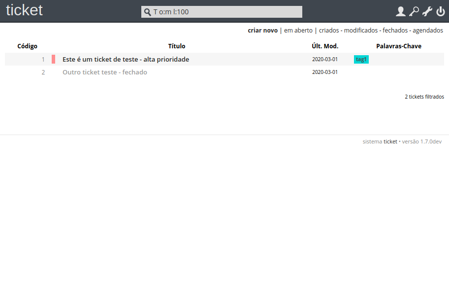
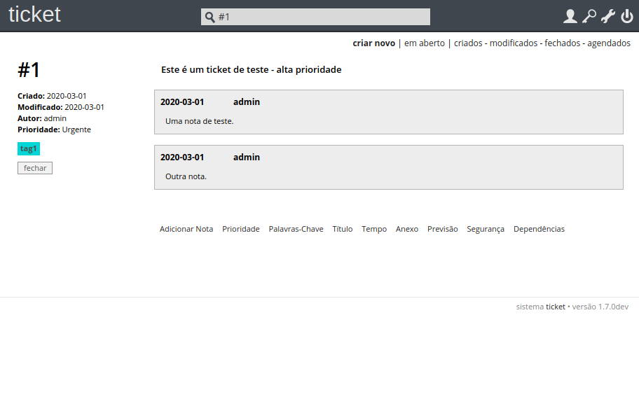

# ticket

`ticket` é um sistema simples de chamados para pequenos departamentos de TI,
para o acompanhamento de casos em aberto sobre qualquer coisa (bugs de software,
tarefas, demandas de helpdesk, etc).

Ele é desenvolvido em Python, e possui poucas dependências de bibliotecas
externas. ticket embute seu próprio servidor web e utiliza um banco de dados
SQLite para armazenar os dados, simplificando sua instalação e manutenção.

**ATENÇÃO**: O branch `master` possui a versão de desenvolvimento do `ticket`.
No momento, o aplicativo está no meio de uma transição do Python 2 para Python
3. Não é recomendável usar este branch em produção.

## Funcionalidades

- Criação de tickets sem burocracia - somente um campo texto para o título é obrigatório.
- Lista tickets por ordem de criação, modificação, e fechamento.
- Filtros avançados para faixas de datas, tags, etc.
- Dependência entre tickets (depende de e bloqueia).
- Envio automático de e-mails das novas notas.
- Bilhetagem de tempo de trabalho nos tickets.
- Agendamento de tickets (com data limite).
- Criação de tags coloridas.
- Definição de prioridades.
- Múltiplos usuários.
- Anexos nos tickets.
- Busca _full-text_.

## Dependências

`ticket` precisa do Python 3.7.

## Instalando ticket

Criando o virtualenv do Python e instalando as dependências:

```bash
make
```

## Configurando ticket

Edite o arquivo `ticket.ini` caso queira alterar alguma configuração.

## Criando o banco de dados vazio

O comando abaixo cria um novo banco de dados SQLite no diretório `./data`:

```bash
make data
```

## Iniciando ticket

Iniciar o servidor web:

```bash
make run
```

Como padrão, o servidor web escuta no host `127.0.0.1`, e na porta `5000`. O
caminho do banco de dados é definido em `ticket.ini`, em `paths.data`.

Agora basta acessar o sistema via navegador. O usuário padrão é `admin` com
senha `admin`. Ao acessar o sistema, crie um usuário para você, dê poderes de
administrador, e exclua o usuário padrão `admin`.

## Screenshots

### Lista de tickets



### Detalhe de um ticket


